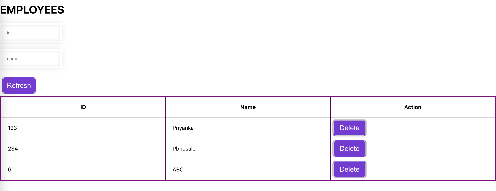
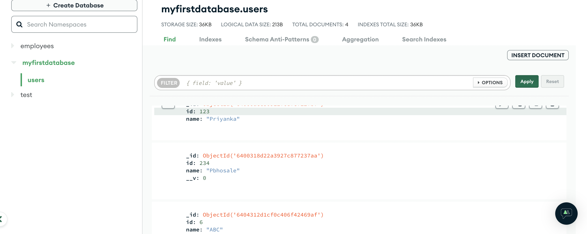
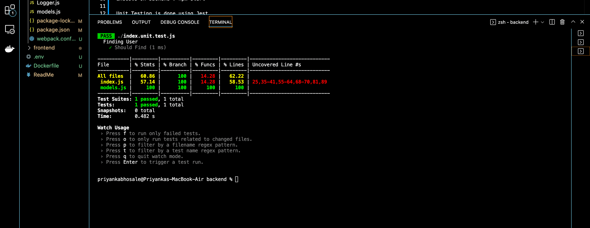
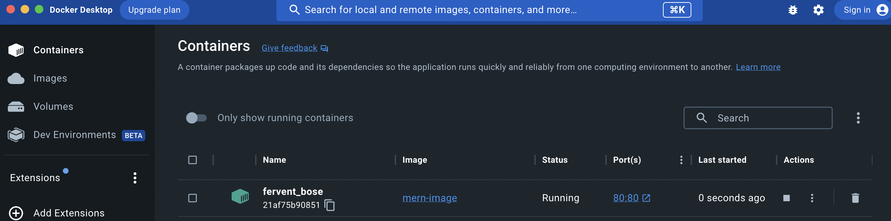
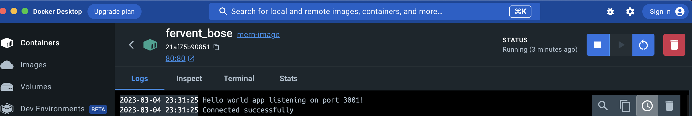

Created a simple MERN full stack application
This handles CRUD operations
API calls are written in Express
Database is MOngoDB
Used mongodb Atlas string connection, replace with your connection string username and password
Refer: https://www.mongodb.com/docs/atlas/getting-started/

Execute on frontend : npm start 
Execute on backend : npm start 

Database Snapshot:

Unit Testing is done using Jest

Execute on backend: npm run test
press q for logging out

Production Build is deployed in Docker.

